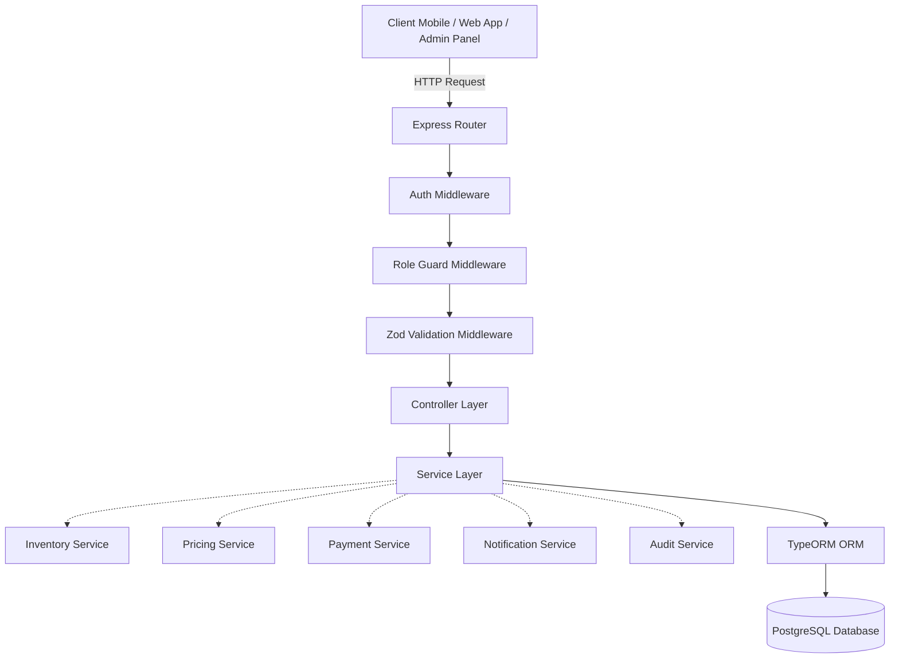
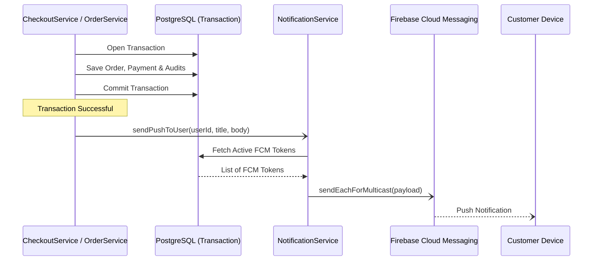

# BuzzMart Backend Architecture

## Overview
BuzzMart is designed as a **Robust Modular Monolith** structured around a layered architecture pattern. The separation of concerns ensures maintainability and extensibility as customer platforms scale from mobile apps to web platforms and admin web panels.

---

## Architectural Layers

### 1. HTTP Router Layer (`src/routes/*`)
Matches incoming HTTP requests to their corresponding controller actions.
* Responsible for setting up manual dependency injection (creating instances of Repositories, Services, and Controllers).
* Mounts middlewares in order: **Authentication** -> **Authorization (Role Guards)** -> **Controller Handlers**.

### 2. Middleware Layer (`src/middlewares/*`)
Cross-cutting security and utility functions:
* **Authentication (`authMiddleware.ts`)**: Decodes JWT and binds the authenticated payload `{ sub: number, role: string, email: string }` to the `req.auth` property.
* **Authorization (`roleGuard.ts`)**: Restricts routes to specific roles (e.g. `admin`, `customer`).
* **Uploads (`uploadMiddleware.ts`)**: Multi-part form handler for local storage uploads.

### 3. Controller Layer (`src/controllers/*`)
Interacts with the incoming HTTP request framework:
* Parses query parameters, path variables, and body values.
* Uses **Zod** validation schemas to validate incoming inputs before executing business logic.
* Formats standard JSON success responses (`{ success: true, message, data, [meta] }`).
* Forwards runtime errors to the global error middleware using `next(error)`.

### 4. Service Layer (`src/services/*`)
Houses the core domain logic, invariants, and business transactions:
* Orchestrates calculations, status evaluations, and notifications.
* **Transaction Control**: Orchestrates atomic database writes (e.g. order placement) using TypeORM `EntityManager.transaction`.
* **Sub-Services**:
  * **`PricingService`**: Authority on financial math, tax rates, and flat/free shipping calculations.
  * **`InventoryService`**: Locks product records and handles inventory reservations (`stock`/`reserved`) during checkout.
  * **`NotificationService`**: Integrates with Firebase Admin SDK for multicast push notifications.
  * **`PaymentService`**: Interfaces with cash-on-delivery references and initializes Razorpay orders.

### 5. Repository & Data Access Layer (`src/config/data-source.ts`)
Configures the connection parameters to the PostgreSQL database, registers entities, and manages connection pools.

### 6. Entity & Database Layer (`src/entities/*`)
Declared database structures using TypeORM decorators. Implements `@Check` constraints on database level to prevent negative stock, prices, or invalid values.

---

## Event-Driven / Async Side Effects Flow
When a business transaction finishes successfully:
1. The service records a database record (e.g., updates payment status, logs audit event).
2. The service initiates a fire-and-forget asynchronous helper callback (e.g., sending push notification).
3. The server responds to the client immediately, ensuring FCM connection latency never blocks checkout checkout operations.

